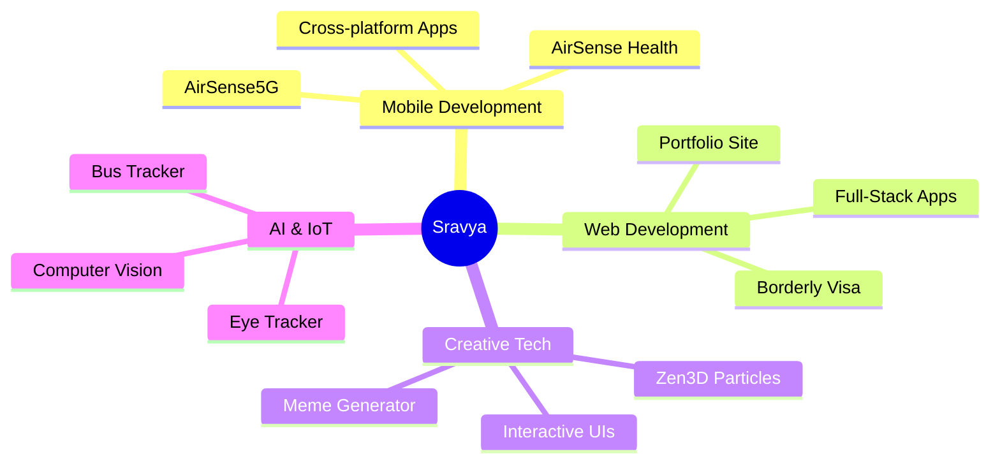

# Hey, I'm Sravya Isukapatla!

<h3 align="center">Computer Science student · Full-Stack &amp; Mobile Developer · IoT, Real-Time Systems &amp; AI/Computer Vision</h3>

  
  
  

---

### Connect with me

  
  
  
  

---

## Résumé

### Education

| Institution | Program | Year | Result |
|-------------|---------|------|--------|
| **Pondicherry University** | B.Sc Computer Science (Honours) | 2023 – 2027 | — |
| **Ashram Public School** | Higher Secondary (CBSE) | 2023 | 83% |
| **St. Joseph Convent School** | ICSE, 10th Grade | 2021 | 80% |

### Experience

- **Research Intern — IIT Madras Energy Consortium** _(May – Jul 2026)_ · *Digital Twin Based Smart Grid Automation System (Ongoing)*
  - Designing a Digital Twin framework for the IEEE-33 bus distribution network to simulate and monitor power distribution systems.
  - Exploring OpenDSS integration for power flow analysis, voltage monitoring, and fault simulation.
  - Planning a Docker-based microservice architecture for voltage monitoring, fault detection, switching control, and service restoration.
  - Researching Retrieval-Augmented Generation (RAG) for natural-language interaction with grid data, plus cloud-native approaches for scalable smart grid automation.

- **Intern — SeraphGuard Labs** _(March 2026)_
  - Developing cross-platform mobile interfaces using Flutter for the Guardian AI parental control platform.
  - Implementing real-time monitoring dashboards for digital activity insights and safety alerts.
  - Integrating backend APIs and collaborating with AI teams to support intelligent monitoring features.

- **Intern — University of Hyderabad | AirSense 5G** _(2024 – 2025)_
  - Developed an IoT-based air-quality monitoring application integrating 5 MQTT sensors with real-time data streaming.
  - Built a Flask backend integrating a local Small Language Model (Phi-2) via LM Studio for intelligent air-quality insights.
  - Implemented a machine-learning prediction pipeline using Linear Regression for environmental metrics.
  - Designed a real-time data pipeline converting MQTT sensor streams into structured datasets with dashboard updates every 30 seconds.

- **Intern — Mobile App Development, ONGC — Dehradun** _(May – Jul 2024)_
  - Developed a cross-platform mobile application using Flutter and Dart with Firebase backend integration.
  - Built responsive interfaces providing real-time access to event schedules, notifications, and updates.
  - Implemented backend data synchronization for dynamic event management and user interaction.

### Certifications & Workshops

- **NPTEL Ethical Hacking Certification** — vulnerability assessment and network security fundamentals.
- **AI/ML for GeoData Analysis (ISRO)** — geo-data processing and machine learning for satellite imagery.
- **Drone Security Workshop** — securing RF/MAVLink communication protocols using Kali Linux.

### Technical Interests

`Cloud Computing` · `Backend Systems` · `Distributed Systems` · `DevOps` · `IoT Platforms`

---

## Tech Stack & Tools

  

  
<b>View detailed skill badges</b>

   

### Languages

### Mobile & Web Frameworks

### Databases & Cloud

### DevOps & Tools

---

## Featured Projects

### Mobile Development

#### [AirSense5G](https://github.com/1651-user/Airsense5g)
*Flutter-based air quality monitoring application*
- Real-time air quality data visualization
- Location-based monitoring
- Cross-platform mobile app
- Clean, intuitive UI

  
  
  
  

#### [AirSense Health](https://github.com/1651-user/airsense-health)
*Health-focused air quality tracker*
- Health recommendations based on air quality
- Data analytics and trends
- Alert system for poor air quality
- TypeScript-powered backend

  
  
  

---

### Creative & Interactive

#### [Zen3DParticles](https://github.com/1651-user/Zen3DParticles)
*Interactive 3D particle system*
- 3D particle animations
- Interactive mouse controls
- Customizable visual effects
- Optimized performance

  
  
  

#### [Meme Generator](https://github.com/1651-user/meme-generator)
*Fun meme creation tool*
- Image upload and editing
- Custom text overlay
- Download generated memes
- Simple, intuitive interface

  
  
  

---

### Web Development

#### [Portfolio Website](https://github.com/1651-user/1651-user.github.io)
*Personal portfolio showcasing my work*
- Modern, responsive design
- Mobile-friendly layout
- Fast loading times
- Deployed on GitHub Pages

*Live:* [1651-user.github.io](https://1651-user.github.io)

  
  

#### [Borderly Visa](https://github.com/1651-user/borderly-visa)
*Full-stack visa application platform*
- Visa application management
- User authentication
- Application tracking
- Full-stack architecture

*Live:* [borderly-visa.vercel.app](https://borderly-visa.vercel.app)

  
  
  

---

### AI & Computer Vision

#### [Eye Tracker](https://github.com/1651-user/eye-tracker)
*Computer vision-based eye tracking system*
- Real-time eye detection
- Webcam integration
- Gaze tracking
- Python-powered

  
  
  

---

### Utility & Tools

#### [Bus Tracker](https://github.com/1651-user/bus_tracker)
*Real-time bus tracking system*
- GPS-based location tracking
- Route visualization
- ETA calculations
- Notifications

  
  
  

#### [Job Bot](https://github.com/1651-user/Job_Bot)
*Automated job posting and applicant tracking*
- Automated job postings
- Applicant management
- Analytics dashboard
- Workflow automation

  
  

#### [Basic Programming](https://github.com/1651-user/basic_programming)
*Programming fundamentals and exercises*
- Learning resources
- Code examples
- Educational content
- Practice projects

  
  

---

## GitHub Analytics & Activity

<table width="100%" border="0" cellpadding="0" cellspacing="0">
  <tr>
    <td width="50%" align="center">
      
    </td>
    <td width="50%" align="center">
      
    </td>
  </tr>
</table>

<table width="100%" border="0" cellpadding="0" cellspacing="0">
  <tr>
    <td width="55%" valign="top">
       
      
        
      
    </td>
    <td width="45%" valign="top" align="center">
       
      <table border="0">
        <tr><td align="center"><b>Metric</b></td><td align="center"><b>Value</b></td></tr>
        <tr><td><i>Total Repositories</i></td><td align="center">11 Public Projects</td></tr>
        <tr><td><i>Primary Languages</i></td><td align="center">TypeScript, Dart, Python, C++</td></tr>
        <tr><td><i>Specializations</i></td><td align="center">Mobile Dev, Web Dev, AI/CV</td></tr>
        <tr><td><i>Active Since</i></td><td align="center">March 2025</td></tr>
      </table>
       
      

        
        
        
        
      

       
      <table border="0">
        <tr><td align="center"><b>Technology</b></td><td align="center"><b>Primary Use</b></td><td align="center"><b>Projects</b></td></tr>
        <tr><td><i>TypeScript</i></td><td align="center">Web Apps, 3D Graphics</td><td align="center">4</td></tr>
        <tr><td><i>Dart / Flutter</i></td><td align="center">Mobile Development</td><td align="center">2</td></tr>
        <tr><td><i>Python</i></td><td align="center">AI/ML, Computer Vision</td><td align="center">1</td></tr>
        <tr><td><i>C++</i></td><td align="center">IoT, Systems Programming</td><td align="center">1</td></tr>
        <tr><td><i>JavaScript / HTML</i></td><td align="center">Web Development</td><td align="center">3</td></tr>
      </table>
       
    </td>
  </tr>
</table>

---

## Skills Matrix

| Domain | Technologies | Proficiency |
|--------|-------------|-------------|
| *Mobile Development* | Flutter, Dart, Cross-platform |  |
| *Web Development* | TypeScript, React, Next.js |  |
| *3D Graphics* | Three.js, WebGL, Particles |  |
| *AI/Computer Vision* | Python, OpenCV, Eye Tracking |  |
| *IoT & Systems* | C++, GPS, Real-time Systems |  |

---

## What I'm Currently Working On

- *Mobile Apps*: Building cross-platform applications with Flutter
- *Health Tech*: Developing air quality monitoring solutions
- *3D Graphics*: Creating interactive particle systems and visualizations
- *AI/ML*: Exploring computer vision and eye tracking technologies
- *Web Development*: Crafting modern, responsive web applications
- *Smart Grids*: Digital Twin automation for IEEE-33 distribution networks at IIT Madras

---

## Project Highlights

---

## Contribution Activity

  <picture>
    <source media="(prefers-color-scheme: dark)" srcset="https://raw.githubusercontent.com/1651-user/1651-user/output/github-contribution-grid-snake-dark.svg">
    <source media="(prefers-color-scheme: light)" srcset="https://raw.githubusercontent.com/1651-user/1651-user/output/github-contribution-grid-snake.svg">
    
  </picture>

---

## Let's Connect!

### I'm always excited to collaborate on:

*Mobile App Development* | *Web Applications* | *Creative Tech Projects* | *AI/ML Experiments*

 

 

 

### If you find my projects interesting, don't forget to star them!

---

  <i>"The best way to predict the future is to invent it." – Alan Kay</i>

  <i>Built with curiosity by Sravya Isukapatla</i>

